# Document technique - 5 janvier 2023

# Présentation générale du projet

# 1. Cadre technique

## Langages et Frameworks:

### Front

- Framework JavaScript : React JS

L'utilisation de ReactJS permettra de rafraîchir les pages en temps réel.

- Library : MUI

La librairie MUI fournit des composants modernes pour faciliter la création de l'interface.

### Back

- Language : Javascript avec NodeJS

- Framework : ExpressJS avec l'ODM Mongoose (MongoDB)

## Base de données

Utilisation d'une base de données non-relationnelle en ligne avec le service MongoDB Atlas.

## Localisation / i18n

Le fuseau horaire du site est Paris (GMT+2). L'interface est uniquement disponible en français.

 

# 2. Description fonctionnelle

 

## Utilisateurs

Les utilisateurs sont répartis en deux catégories, nous appellerons ici :

* player : les clients qui cherchent à réserver une salle de jeu à l'Escape Game

* admin : le responsable de l'Escape qui peut paramétrer la disponibilité des salles de jeu

 

## Affichage des salles disponibles

La page d'accueil du site affiche les salles de jeu disponibles ainsi que quelques informations par salle (prix, capacité, description).
Lorsqu'on clique sur une salle, on accède à la page de la salle de jeu, qui affiche les créneaux disponibles.
Pour les utilisateurs loggés, un bouton "Réserver" leur permet de réserver un créneau.

 

## Compte utilisateur

Un utilisateur anonyme a la possibilité de se créer un compte ou de se connecter (et déconnecter)
Un utilisateur connecté a accès à l'historique de ses réservations (passées et à venir), et peut faire de nouvelles réservations.

 

## Réservation de salle pour les utilisateurs enregistrés

Lorsqu'un utilisateur veut réserver un créneau, il a accès à une page où il choisit le nombre de participants et entre les informations des participants.

Le créneau ainsi réservé devient indisponible aux autres utilisateurs. Il est affiché dans l'espace de gestion des réservations de l'utilisateur ayant fait la réservation.

 NB: un utilisateur doit avoir 18 ans minimum au moment de la réservation.

 

# Maquettes 

 Utilisateur non-connecté :

 - signin : 
 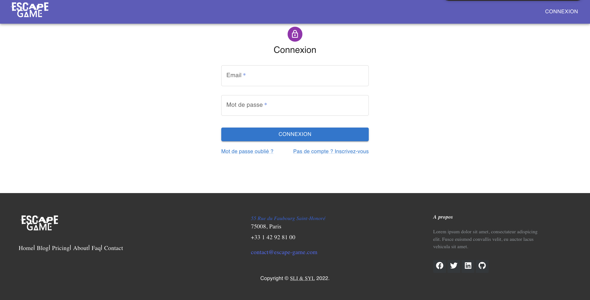

 - signup :
 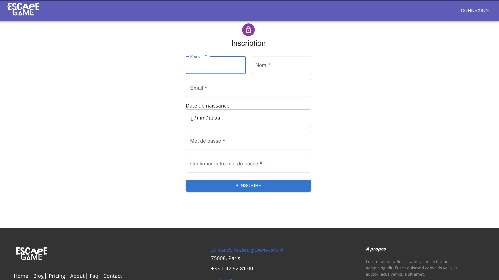

 - list : 
 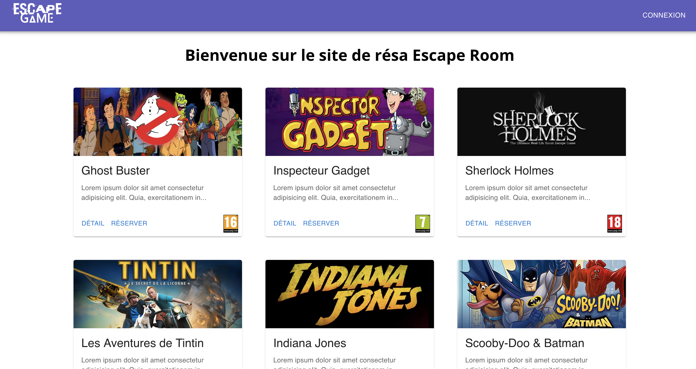

 - details :
 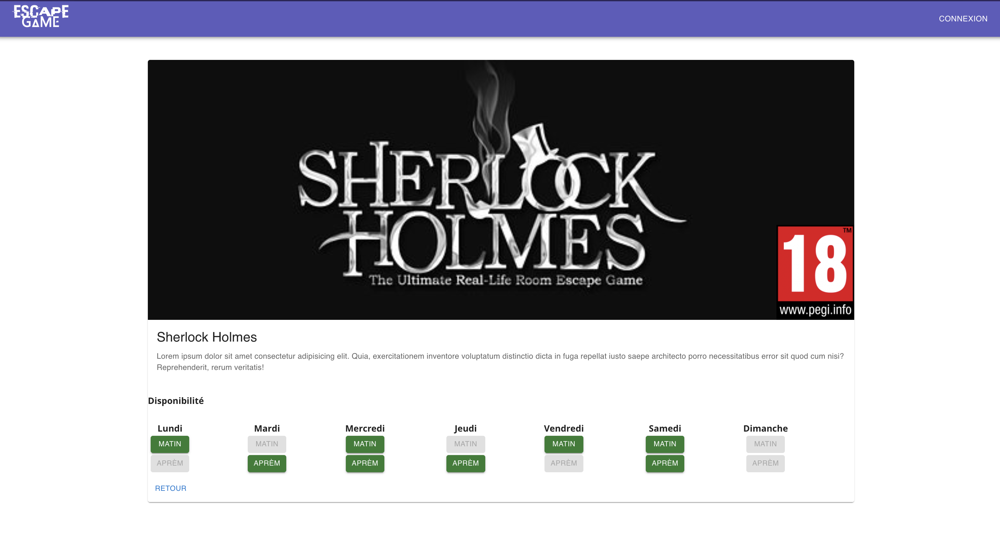

- booking :
 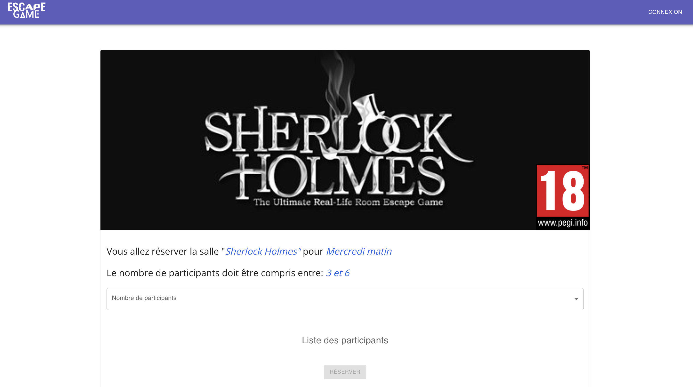

 Utilisateur connecté : 

- list :
 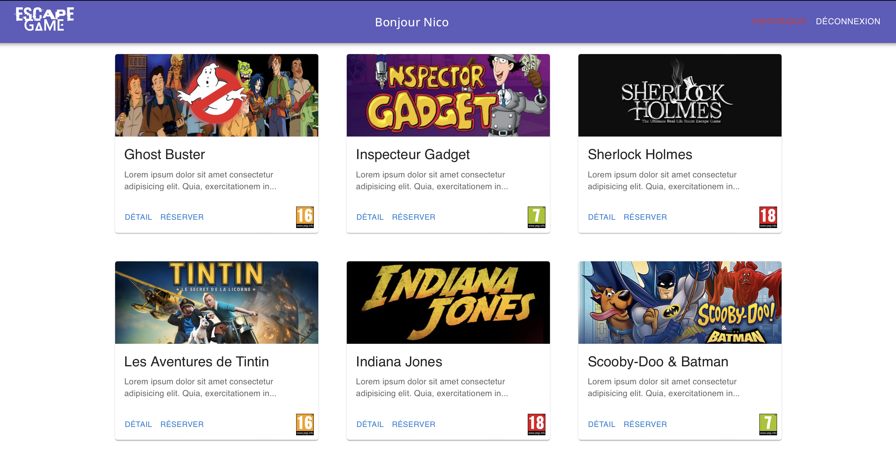

 - booking :
 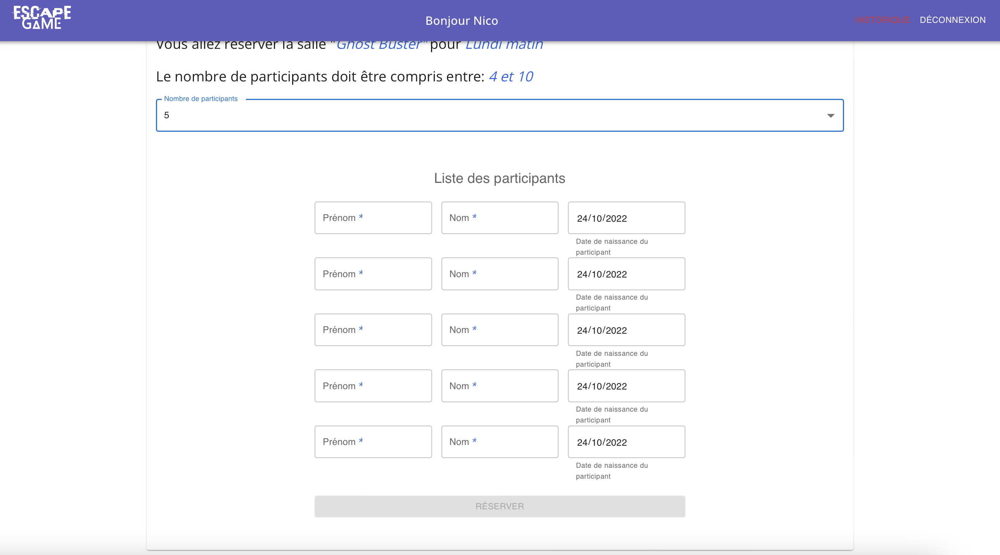

 - history :
 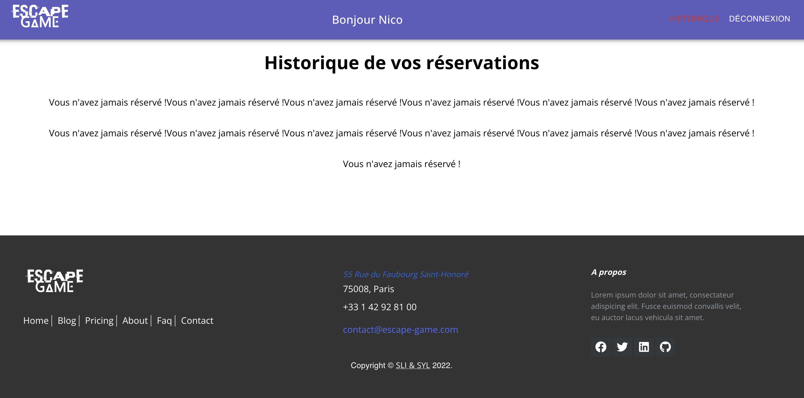

- details :
 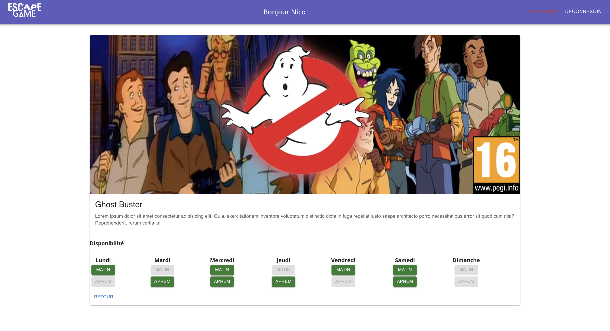

 - booking :
 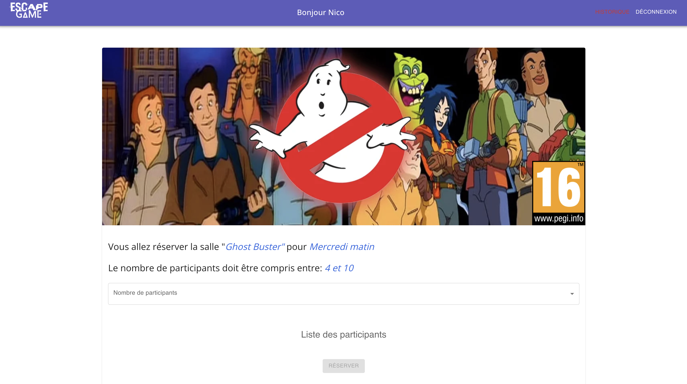

 - booking :
 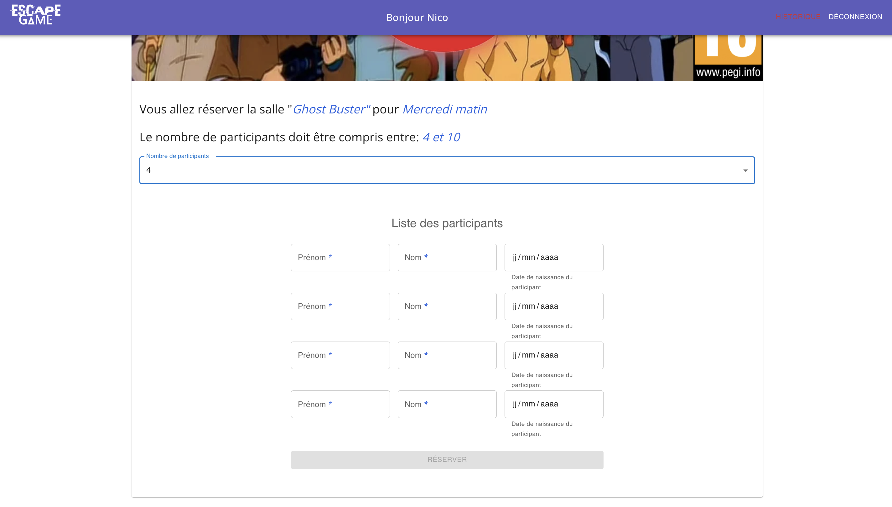
